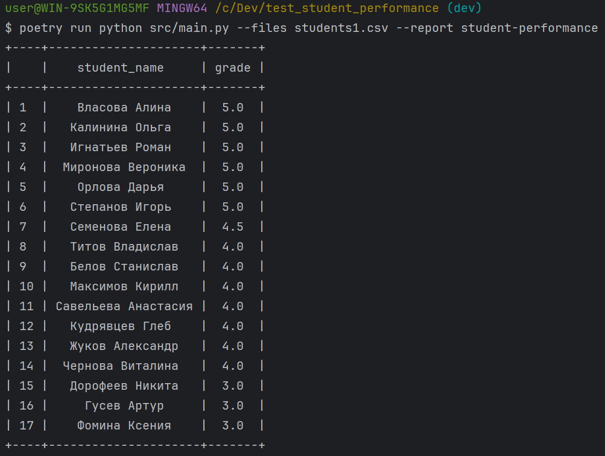
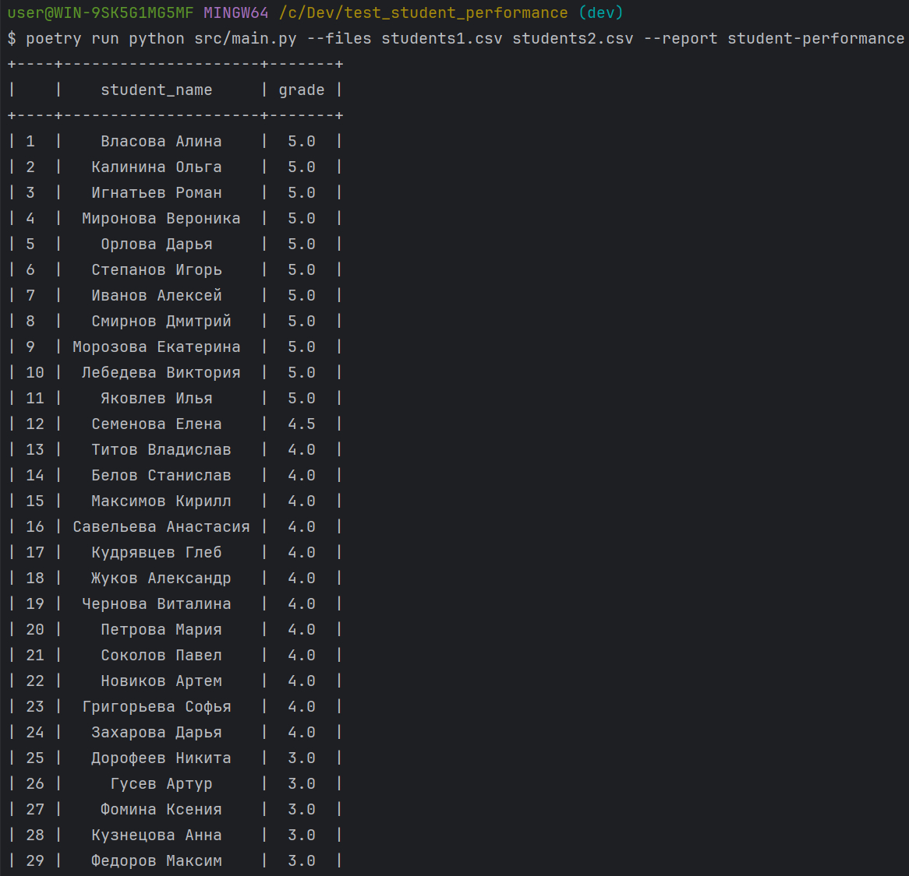
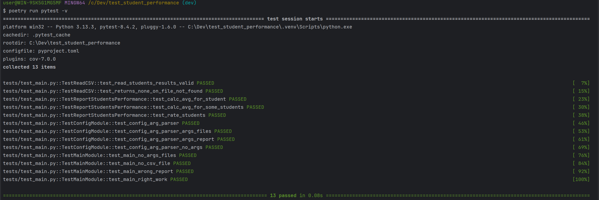
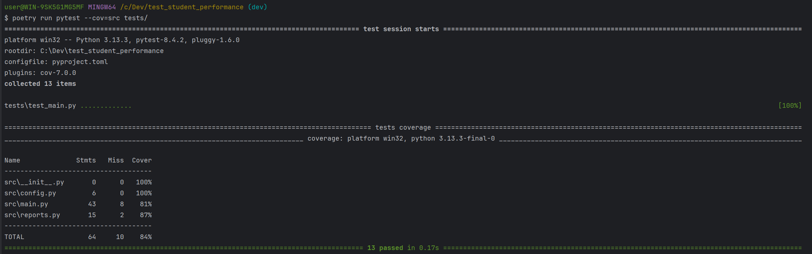

# test_student_performance
Тестовое задание на позицию Junior Backend Python Developer в WorkMate

## Стек
Менеджер пакетов - <b>poetry</b><br>
Линтер, форматер - <b>ruff</b><br>
Также использован <b>pre-commit</b>

## Установка проекта
1. Клонировать проект локально:
   ```git clone git@github.com:sibiry-k/test_student_performance.git```
3. Установить Poetry:
   ```pip install poetry```
4. Установить зависимости проекта
   ```poetry install```


## Запуск скрипта
```poetry run python src/main.py --files students1.csv students2.csv --report student-performance```
### С одним файлом данных:


### С двумя файлами данных:


## Запуск тестов
```poetry run pytest -v```


## Запуск тестов с подсчетом покрытия
```poetry run pytest --cov=src tests/```


## Добавление новых отчетов:
В модуль ```reports.py``` добавить функцию формирования нового отчета ```def new_report```.<br>
В модуль ```main.py``` импортировать новую функцию подсчета и добавить ее в функцию ```main()``` в блок ```try``` после вызова функции ```report_students_performance```, передав в качестве аргумента ```(common_data)```.<br>
Пример: ```new_report(common_data)```
